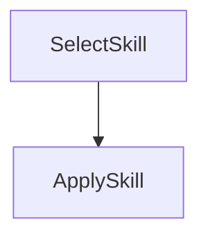

# Agent Skills with PocketFlow

This cookbook shows a lightweight pattern for using **Agent Skills** inside a PocketFlow graph.

Agent Skills are just reusable instruction files (Markdown) that you can route to at runtime.

## What this demo does

- keeps skills as local markdown files (`./skills/*.md`)
- chooses a skill based on the user request
- injects the chosen skill into the final LLM prompt

## Flow



1. **SelectSkill** picks a skill file (e.g. executive brief vs checklist writer)
2. **ApplySkill** reads that skill and executes the task with the LLM

## Run

```bash
pip install -r requirements.txt

# Use SPL shim (no OpenAI key needed)
export SPL_ADAPTER=ollama   # or claude_cli
export SPL_MODEL=gemma3     # or claude-sonnet-4-6
```

### Basic usage

```bash
cd ./cookbook/pocketflow-agent-skills

# brief style
SPL_ADAPTER=ollama SPL_MODEL=gemma3 \
python main.py --task "Summarize this learning Chinese blog for business executive" \
    --text "data/learn-chinese.md" \
    --out "output/learn-chinese-brief.md"

SPL_ADAPTER=claude_cli \
python main.py --task "Summarize this blog" \
    --text "data/llama-cpp-vs-ollama.md" \
    --out "output/get-started-with-adopt-llama-cpp.md"

# Checklist style
SPL_ADAPTER=claude_cli \
python main.py --task "Turn this blog into checklist" \
    --text "data/llama-cpp-vs-ollama.md" \
    --out "output/adopt-llama-cpp-checklist.md"


```

### Options

| Option | Default | Description |
|---|---|---|
| `--task` | `"Summarize this text for a VP audience"` | What to do with the text |
| `--text` | _(none)_ | Literal text string **or** path to a `.md` / `.txt` file |
| `--out`  | _(stdout)_ | File path to save the output |

## Files

- `main.py` — Click CLI entry point
- `flow.py` — graph wiring
- `nodes.py` — skill selection + execution nodes
- `utils.py` — load skills + LLM helper
- `skills/*.md` — reusable Agent Skills
- `data/` — sample input documents for testing
